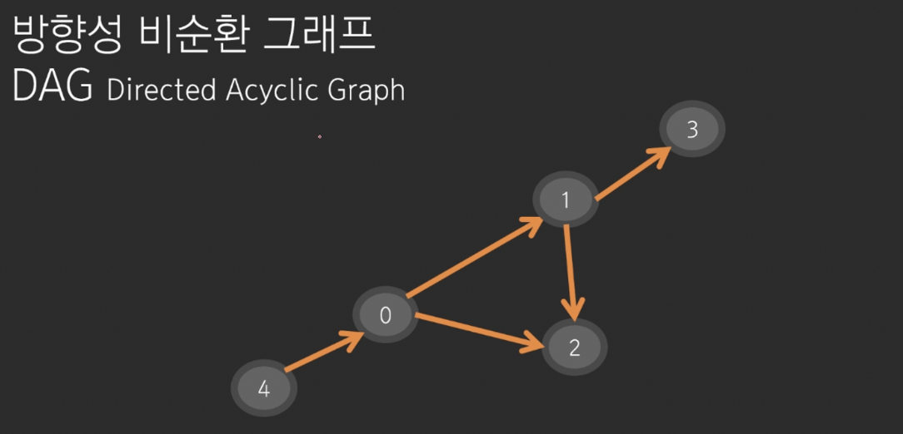
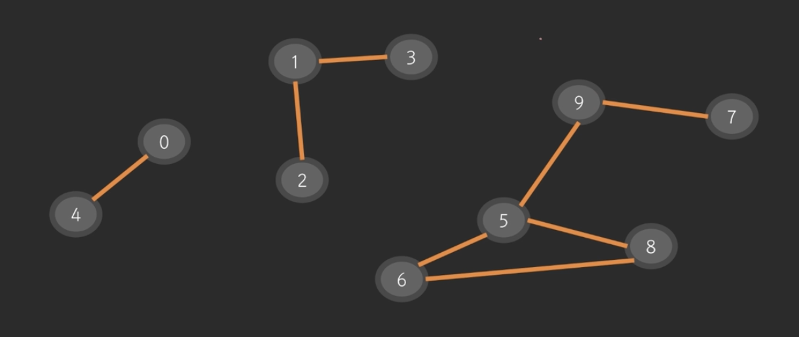
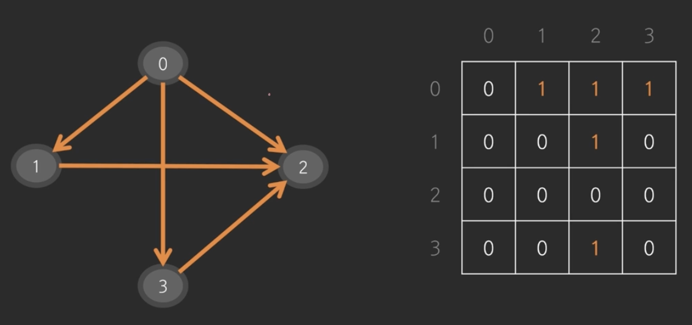
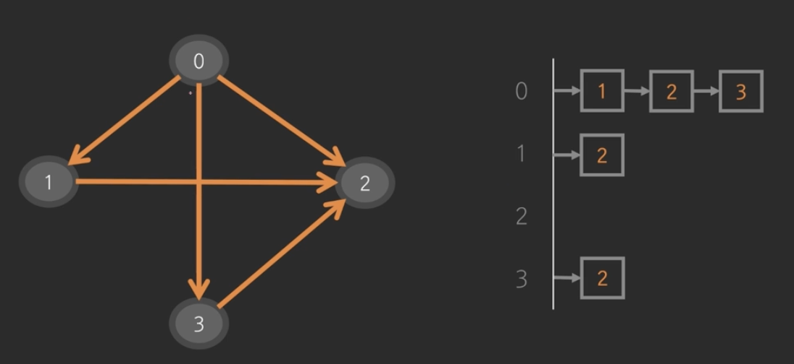

# 그래프 (Graph)

## 그래프의 종류 
1. 방향성  
무방향 그래프: 방향이 없다 (= 양방향 그래프)
방향 그래프: 방향이 있다

2. 순환성  
순환 그래프 (cycle이 있는)  
비순환 그래프   

    > 방향성 비순환 그래프: DAG (Directed Acyclic Graph) 

## 연결요소 Connected Component 


# 트리 Tree 
(이론상의 트리)   
순환성이 없는 무방향 그래프 (사이클 존재 x)
- 특정하지 않는 한 어떤 노드든지 루트 (root)가 될 수 있다.
- 가장 바깥쪽 노드는 리프노드 (leaf node)
- node A에서 node B로 가는 경로는 반드시 존재하며 유일하다.
- 노드개수 = 간선개수 + 1 (트리 여부 검사 가능)  

(자료구조상의 트리)
- 자료구조에서의 트리는 부모 -> 자식 관계가 있는 방향 그래프이다. 
- 루트는 하나다. 

# 코드
1. 인접행렬 


2. 인접리스트 


3. 비교 
인접행렬: 간선이 많은 그래프의 경우 사용 
- 간선의 개수에 관계없이 E^2 메모리 할당 
- 시간복잡도: O(1)

인접리스트: 간선이 적은 그래프의 경우 사용 
- 간선이 적은 경우 메모리 효율적
- 시간복잡도: O(E)

|정점의 개수|간선의 개수|구현방식|
|--------|--------|-------|
|N|N^2|인접행렬|
|N|2N|인접리스트|

# DFS, BFS, 백트래킹
모두 완전탐색 알고리즘이다. (최악의 경우 모든 노드를 탐색한다.)
- 최단거리를 구할 때: BFS 
- 가지치기를 하면 백트래킹 

## DFS (Depth First Search): 깊이 우선 탐색 
스택 or 재귀를 사용해서 구현한다. 

## BFS (Breadth First Search): 너비 우선 탐색 
큐를 사용해서 구현한다.

공통점
- 그래프 탐색 알고리즘이다.
- 완전 탐색 알고리즘이다.
    - 장점: 모든 경우의 수를 다 살펴보기 때문에 반드시 답을 찾을 수 있다.
    - 단점: 느리다.

차이점
최단거리탐색을 할 때 보통은 BFS를 사용하는 것이 더 빠르다.
- 최단거리탐색: 다익스트라, 프로이드워셜 참고 

시간복잡도
- 인접행렬: O(V^2)
- 인접리스트: O(V+E) = O(max(V, E))

길찾기 문제
- 방문체크 필요
- 각 칸이 노드 
- 상하좌우 4방향의 간선 
```python
from collections import deque

dy = (0, 1, 0, -1)
dx = (1, 0, -1, 0)
chk = [[False] * 100 for _ in range(100)]
N = int(input())

def is_valid_coord(y, x):
    return 0 <= y < N and 0 <= x < N

def bfs(start_y, start_x):
    q = deque()
    q.append((start_y, start_x))
    while len(q) > 0:
        y, x = q.popleft()
        chk[y][x] = True
        for k in range(4):
            ny = y + dy[k]
            nx = x + dx[k]
            if is_valid_coord(ny, nx) and not chk[ny][nx]: # 유효한 칸이면서 방문을 하지 않았을 때 
                q.append((ny, nx))
```

# 백트래킹 Backtracking 
- 기본적으로 **모든 경우를 탐색**하며 DFS, BFS와 방식은 유사하다.
- 백트래킹은 **가지치기**를 통해 탐색 경우의 수를 줄인다는 차이가 있다. 
  - 최악의 경우, 모든 경우를 다 살펴보게 될 수도 있지만 가능한 덜 보겠다는 전략 (가망성이 없으면 가지 않는다)
